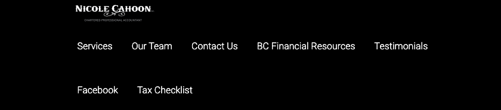
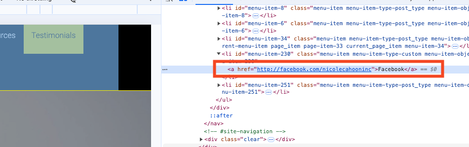

# HTML & CSS Project

## My Observations

I selected this website as my project to improve: http://nicolecahoon.com/

I identified several issues that can be enhanced:

- On the home page, the navigation content wraps awkwardly at mobile width.

- On each page, the banner image of the person is too large, making it difficult to view on any screen size.

- On the home page, there is excessive space in the contact info section.

- On the "Our Team" page, the images and articles are misaligned; sometimes the image appears above the article, and sometimes it does not.

 

- Considering that "Our Services," "Contact Us," and "Testimonials" have minimal content, I plan to integrate them into the home page.

- The content on some pages is not center-aligned.

- Clicking the Facebook tab leads to the Facebook homepage, which feels disorienting. I need to fix this.

## My Plan

### Pages Structure

- Home page
  - Header
    - Logo
    - Navigation
  - Main
    - Hero
    - Services
    - Our Team
    - Video Introduction
    - Testimonials
    - Resources
  - Footer
    - Logo
    - Contact Information
    - Address with Google Map
    - Copyright
    - Disclaimer
- Services page
  - Header
    - Logo
    - Navigation
  - Main
    - Introduction
    - Accounting Serveces
    - Tax Services
    - Business Consulting
  - Footer
    - Logo
    - Contact Information
    - Address with Google Map
    - Copyright
    - Disclaimer
- Our Team page
  - Header
    - Logo
    - Navigation
  - Main
    - Introduction
    - Team Member Profiles
    - Availability Table
    - Appointment Form
  - Footer
    - Logo
    - Contact Information
    - Address with Google Map
    - Copyright Notice
    - Disclaimer
